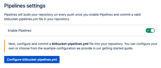
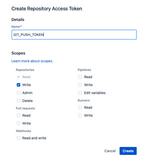
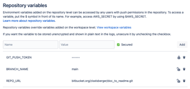

# Add Module Documentation to README

**Author:** Mirjam Ziselsberger  
**Created:** 15.03.2023  
**Last Update:** 16.03.2023

## What?
Automated docstring extraction and creation/update of module documentation in README.md File

## Why?
Because it's nice :-)

## Current status
Works in GitLab and Bitbucket :-) Yay!

### GitLab
Super helpful blog post on how to update files in Repo within CI/CD Pipeline: https://parsiya.net/blog/2021-10-11-modify-gitlab-repositories-from-the-ci-pipeline/

### Bitbucket

#### How to update files within Bitbucket Pipeline:

1. **Enable Pipelines**   

  > Repository Settings > `PIPELINES` > Settings  
  
  
    

2. **Create Repository Access Token**  

  > Repository Settings > `SECURITY` > Access tokens  
   
   
     

     * **Name**: GIT_PUSH_TOKEN (does not really matter)    
     * **Scopes**:
       Repositories:   
         [x] read
         [x] write  

3. **Add Repository Variables**  

  > Repository Settings > `PIPELINES` > Repository Variables  
  
     

    * **GIT_PUSH_TOKEN** = Access Token (**secure!**)  
    * **BRANCH_NAME** = Branch to be updated automatically  
    * **REPO_URL** = URL without https://  

4. **Create [bitbucket-pipelines.yml](bitbucket-pipelines.yml)**

>     image: alpine:latest

>     pipelines:
        default:
          - step:
              name: update_docu
              .push: &push |
                lines=$(git status -s | wc -l)
                if [ $lines -gt 0 ];then
                  git add ../README.md
                  git commit -m "Auto-update README.md [skip ci]"
                  echo "git push 'https://x-token-auth:${GIT_PUSH_TOKEN}@${REPO_URL}' ${BRANCH_NAME}"
                  git push "https://x-token-auth:${GIT_PUSH_TOKEN}@${REPO_URL}" $BRANCH_NAME
                fi 
              script:
                - apk add bash git
                - apk add --no-cache python3
                - git fetch
                - cd ./src
                - python3 doc_to_md.py
                - *push