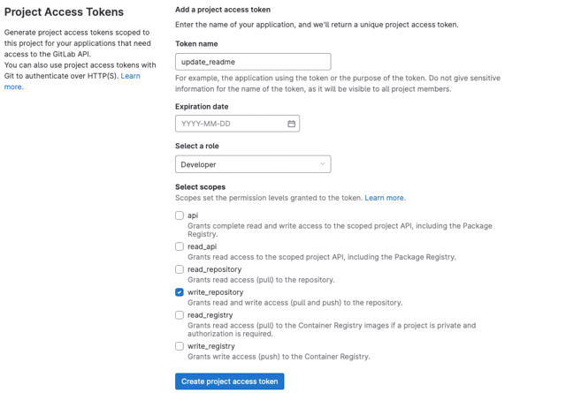
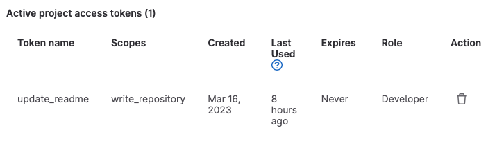
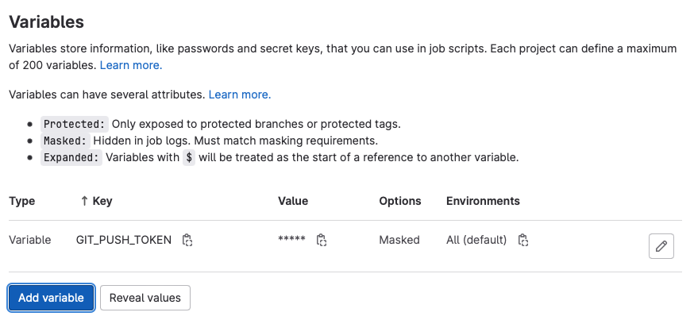
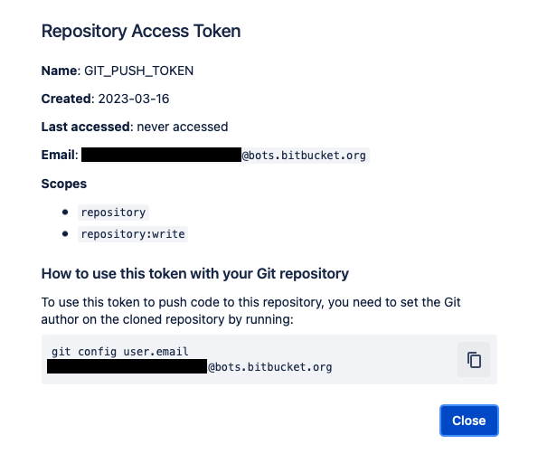
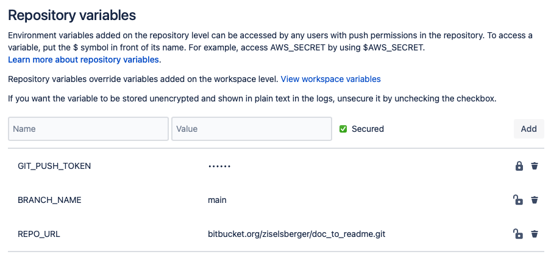

# Automatic Module Documentation in README

**Author:** Mirjam Ziselsberger  
**Created:** 15.03.2023  
**Last Update:** 18.03.2023

## What's this?
Automated docstring extraction and creation/update of module documentation in README File

### Why?
Because it's nice :-)

### How?
[doc_to_md.py](src/doc_to_md.py) loops through all Python files in the Repository and extracts 
the function calls + the corresponding short description from the docstrings.
These are added to a dictionary and afterwards converted to Markdown Table.  
Finally, the section 'Function & Classes' is appended / updated in the README File.

**Open TODOs:**  
- add Classes to the Table  
- add Unittests  

### Where?
Works in GitLab and Bitbucket :-) Yay!  
> * The Pipeline YAML files differ a little bit, so pay attention to the infos below :-)  
> * This pipe-internal `*push` script  checks for changes (using git status) and if so, 
> commits and pushes the changes in the README File.

### GitLab
Super helpful blog post on how to update files in Repo within CI/CD Pipeline: https://parsiya.net/blog/2021-10-11-modify-gitlab-repositories-from-the-ci-pipeline/

#### How to update files within GitLab Pipeline:

1. **Add Project Access Token**: Settings > `Access Tokens`

      
    

2. **Add GIT_PUSH_TOKEN to CICD Variables**: Settings > `CICD` > Variables

    

  * **Key** =  GIT_PUSH_TOKEN
  * **Value** = Access Token
  * **Txpe** = Variable
  * `[x] Mask variable`!

3. **Create [GitLab Pipeline](.gitlab-ci.yml)**

>        variables: 
>          BRANCH_NAME: "main"
>          BOT_NAME: "MJAM"
>          BOT_EMAIL: "mjam@update_readme.com"
>          COMMIT_MESSAGE: "Auto-update README.md"
>        
>        .push: &push |
>          git status
>          lines=$(git status -s | wc -l)
>          if [ $lines -gt 0 ];then
>            git config --global user.name "${BOT_NAME}"
>            git config --global user.email "${BOT_EMAIL}"
>            git add ../README.md
>            git commit -m "${COMMIT_MESSAGE}"
>            git push -o ci.skip "https://${BOT_NAME}:${GIT_PUSH_TOKEN}@${CI_REPOSITORY_URL#*@}" $BRANCH_NAME
>          fi 
>        
>        update_docu:
>          image: alpine:latest
>          before_script:
>            - apk add bash git
>            - apk add --no-cache python3
>            - git config --global pull.rebase false
>            - git fetch
>            - git checkout $BRANCH_NAME
>            - git pull
>            - cd ./src
>          script:
>            - python doc_to_md.py
>            - *push

#### Some further info:  
 
- Environment variables: `GIT_PUSH_TOKEN` (Repository Access Token) and `CI_REPOSITORY_URL`
- Local variables are listed in the YAML File.
- It's necessary to set the git user.name and user.email
- It's necessary to check out the main branch and pull again, otherwise a merge conflict happens.
- `-o ci.skip` is necessary for not triggering the CI again (and again) with the update of the README File

---

### Bitbucket

#### How to update files within Bitbucket Pipeline:

1. **Enable Pipelines**: Repository Settings > `PIPELINES` > Settings

2. **Create Repository Access Token**: Repository Settings > `SECURITY` > Access tokens    

      

    **Scopes** > `Repositories`  
    [x] read   
    [x] write   

3. **Add Repository Variables**: Repository Settings > `PIPELINES` > Repository Variables  
  
      

  * **GIT_PUSH_TOKEN** = Access Token (**secure!**)   
  * **BRANCH_NAME** = Branch to be updated automatically   
  * **REPO_URL** = URL without https://  

4. **Create [Bitbucket Pipeline](bitbucket-pipelines.yml)**

>      image: alpine:latest
>      
>      pipelines:
>        default:
>          - step:
>              name: update_docu
>              .push: &push |
>                lines=$(git status -s | wc -l)
>                if [ $lines -gt 0 ];then
>                  git add ../README.md
>                  git commit -m "Auto-update README.md [skip ci]"
>                  echo "git push 'https://x-token-auth:${GIT_PUSH_TOKEN}@${REPO_URL}' ${BRANCH_NAME}"
>                  git push "https://x-token-auth:${GIT_PUSH_TOKEN}@${REPO_URL}" $BRANCH_NAME
>                fi 
>              script:
>                - apk add bash git
>                - apk add --no-cache python3
>                - git fetch
>                - cd ./src
>                - python3 doc_to_md.py
>                - *push

#### Some further info:  
 
- All variables are stored as repository variables.
- The **User** in the git push command has to be **x-token-auth**.
- Bitbucket does not allow push options like GitLab (`-o ci.skip`).  
  To skip the Pipeline you have to add `[skip ci]` or `[ci skip]` to the commit message.
